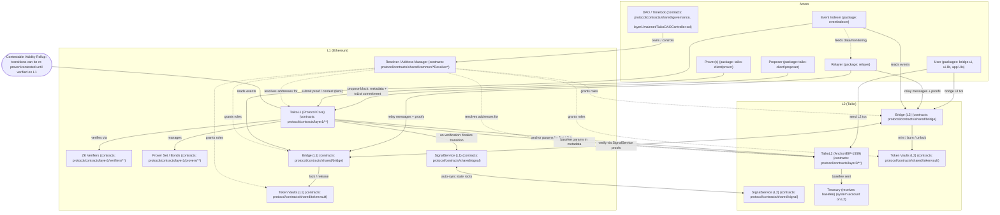

### Taiko Protocol Architecture (High-level)

```mermaid
graph TB
  %% High-level Taiko Protocol Architecture mapped to repo packages

  subgraph "Actors"
    U["User (packages: bridge-ui, ui-lib, app UIs)"]
    P["Proposer (package: taiko-client/proposer)"]
    V["Prover(s) (package: taiko-client/prover)"]
    R["Relayer (package: relayer)"]
    IDX["Event Indexer (package: eventindexer)"]
    G["DAO / Timelock (contracts: protocol/contracts/shared/governance,  layer1/mainnet/TaikoDAOController.sol)"]
  end

  subgraph "L1 (Ethereum)"
    L1T["TaikoL1 (Protocol Core) (contracts: protocol/contracts/layer1/**)"]
    VER["ZK Verifiers (contracts: protocol/contracts/layer1/verifiers/**)"]
    PS["Prover Set / Bonds (contracts: protocol/contracts/layer1/provers/**)"]
    L1S["SignalService (L1) (contracts: protocol/contracts/shared/signal)"]
    L1B["Bridge (L1) (contracts: protocol/contracts/shared/bridge)"]
    L1V["Token Vaults (L1) (contracts: protocol/contracts/shared/tokenvault)"]
    RES["Resolver / Address Manager (contracts: protocol/contracts/shared/common/*Resolver*)"]
  end

  subgraph "L2 (Taiko)"
    L2T["TaikoL2 (Anchor/EIP-1559) (contracts: protocol/contracts/layer2/**)"]
    L2S["SignalService (L2) (contracts: protocol/contracts/shared/signal)"]
    L2B["Bridge (L2) (contracts: protocol/contracts/shared/bridge)"]
    L2V["Token Vaults (L2) (contracts: protocol/contracts/shared/tokenvault)"]
    TR["Treasury (receives basefee) (system account on L2)"]
  end

  %% L2 usage
  U -->|"send L2 txs"| L2T
  U -->|"bridge UI txs"| L2B

  %% Proposing / Anchoring
  P -->|"propose block: metadata + txList commitment"| L1T
  L1T -->|"anchor params for first L2 tx"| L2T

  %% Proving / Contesting (contestable validity rollup)
  V -->|"submit proof / contest (tiers)"| L1T
  L1T -->|"verifies via"| VER
  L1T -->|"manages"| PS
  L1T -->|"on verification: finalize transition"| L1S

  %% State root sync (auto by protocol)
  L1S <--> |"auto-sync state roots"| L2S

  %% EIP-1559 on L2
  L1T -->|"basefee params in metadata"| L2T
  L2T -->|"basefee sent"| TR

  %% Bridging via SignalService proofs
  R -->|"relay messages + proofs"| L2B
  R -->|"relay messages + proofs"| L1B
  L2B <--> |"verify via SignalService proofs"| L1B
  L1B -->|"lock / release"| L1V
  L2B -->|"mint / burn / unlock"| L2V

  %% Indexing / Infra
  IDX -->|"reads events"| L1B
  IDX -->|"reads events"| L2B
  IDX -.->|"feeds data/monitoring"| R

  %% Access control / governance
  G -->|"owns / controls"| RES
  RES -.->|"grants roles"| L1B
  RES -.->|"grants roles"| L2B
  RES -.->|"grants roles"| L1V
  RES -.->|"grants roles"| L2V
  RES -.->|"resolves addresses for"| L1T
  RES -.->|"resolves addresses for"| L2T

  %% Optional note
  note1(["Contestable Validity Rollup: transitions can be re-proven/contested until verified on L1"]) 
  note1 --- L1T
```

