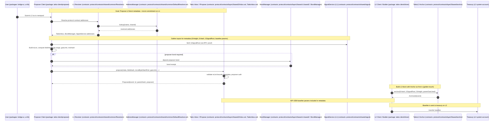

### Taiko Protocol Architecture (Mid-level: Block Proposal)

#### Notes
- Proposer client modules: `packages/taiko-client/proposer`, uses `packages/taiko-client/driver` to build L2 blocks and include the anchor tx.
- L1 proposal entrypoints: `protocol/contracts/layer1/based2/IPropose.sol`, `Inbox.sol`, `TaikoInbox.sol` (network-specific variants under `layer1/mainnet`, `layer1/hekla`, etc.).
- Bonds: `protocol/contracts/layer1/based/IBondManager.sol`, `based2/IBondManager2.sol`, with state helpers in `based2/state/LibBonds.sol`.
- Resolver and address management: `protocol/contracts/shared/common/*Resolver*`, `DefaultResolver.sol`.
- Signal Service (L1/L2): `protocol/contracts/shared/signal`, provides `signalRoot` used by the anchor.
- TaikoL2 anchor and EIP-1559: `protocol/contracts/layer2/based/anchor/*`, `layer2/based/eip1559/*`.

