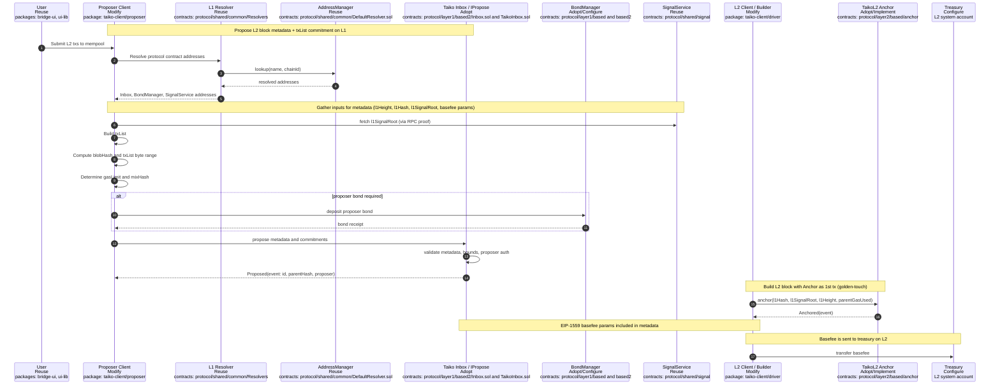

### Migration Guide: Mid-level Block Proposal (zk Rollup → Based Rollup)

Legend: Reuse = keep as-is; Adopt = deploy/use Taiko module; Configure = params/addresses; Modify = code changes/adapters.

#### What to Modify vs Reuse
- Modify
  - Proposer client: `packages/taiko-client/proposer` (adapter to your L2 execution client, txList building, config for L1 addresses and chains).
  - L2 client/builder: `packages/taiko-client/driver` (ensure anchor as first tx; integrate basefee path).
  - L2 chain integration: implement or adapt `protocol/contracts/layer2/based/anchor/*` to your chain specifics.

- Adopt/Configure
  - L1 Inbox/IPropose: `protocol/contracts/layer1/based2/{Inbox.sol, TaikoInbox.sol}` (deploy; wire into resolver; set limits).
  - Bonding/policy: `protocol/contracts/layer1/based{,2}` (BondManager, LibBonds) according to your economics.
  - Treasury and EIP-1559 params: configure destination address and curve parameters.

- Reuse (minimal/no changes)
  - SignalService (L1/L2): `protocol/contracts/shared/signal`.
  - Address resolution: `protocol/contracts/shared/common/*Resolver*`, `DefaultResolver.sol`.
  - UI packages (where applicable): `packages/bridge-ui`, `packages/ui-lib`.

Notes:
- If you replace proof systems later, do so in verifier contracts and prover client; it does not affect the proposal flow shown here.
- Keep interfaces stable to maximize reuse; add adapters at client boundaries rather than changing shared contracts.

