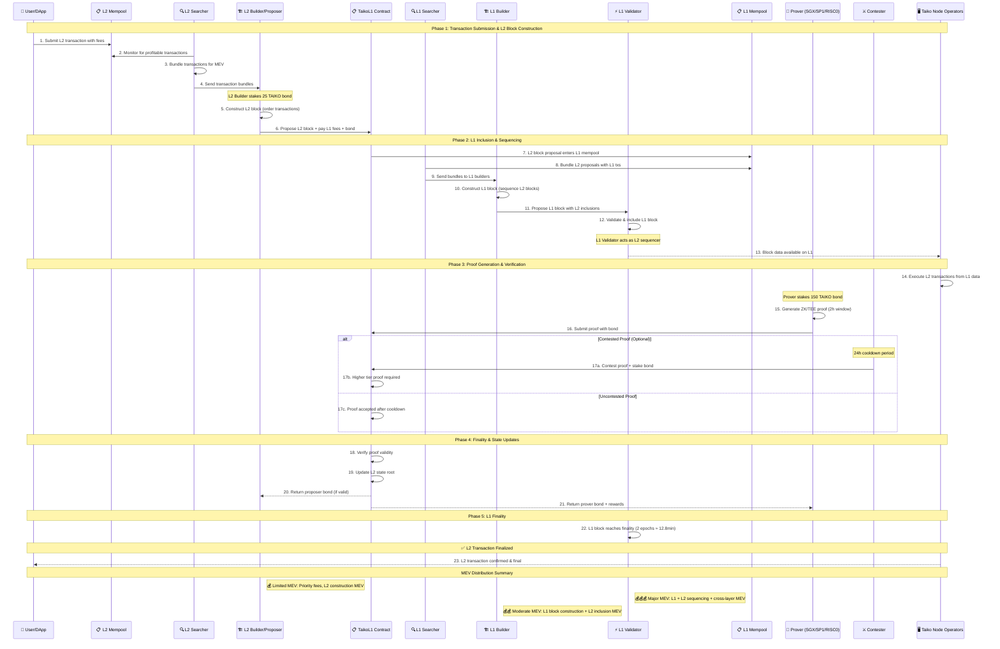

```mermaid
sequenceDiagram
    participant User as 👤 User/DApp
    participant L2Mempool as 📋 L2 Mempool
    participant L2Searcher as 🔍 L2 Searcher
    participant L2Builder as 🏗️ L2 Builder/Proposer
    participant TaikoL1 as 📋 TaikoL1 Contract
    participant L1Searcher as 🔍 L1 Searcher
    participant L1Builder as 🏗️ L1 Builder
    participant L1Validator as ⚡ L1 Validator
    participant L1Mempool as 📋 L1 Mempool
    participant Prover as 🔐 Prover (SGX/SP1/RISC0)
    participant Contester as ⚔️ Contester
    participant TaikoNode as 🖥️ Taiko Node Operators

    Note over User, TaikoNode: Phase 1: Transaction Submission & L2 Block Construction
    User->>L2Mempool: 1. Submit L2 transaction with fees
    L2Searcher->>L2Mempool: 2. Monitor for profitable transactions
    L2Searcher->>L2Searcher: 3. Bundle transactions for MEV
    L2Searcher->>L2Builder: 4. Send transaction bundles
    
    Note over L2Builder: L2 Builder stakes 25 TAIKO bond
    L2Builder->>L2Builder: 5. Construct L2 block (order transactions)
    L2Builder->>TaikoL1: 6. Propose L2 block + pay L1 fees + bond
    
    Note over User, TaikoNode: Phase 2: L1 Inclusion & Sequencing
    TaikoL1->>L1Mempool: 7. L2 block proposal enters L1 mempool
    L1Searcher->>L1Mempool: 8. Bundle L2 proposals with L1 txs
    L1Searcher->>L1Builder: 9. Send bundles to L1 builders
    L1Builder->>L1Builder: 10. Construct L1 block (sequence L2 blocks)
    L1Builder->>L1Validator: 11. Propose L1 block with L2 inclusions
    L1Validator->>L1Validator: 12. Validate & include L1 block
    
    Note over L1Validator: L1 Validator acts as L2 sequencer
    L1Validator-->>TaikoNode: 13. Block data available on L1
    
    Note over User, TaikoNode: Phase 3: Proof Generation & Verification
    TaikoNode->>TaikoNode: 14. Execute L2 transactions from L1 data
    
    Note over Prover: Prover stakes 150 TAIKO bond
    Prover->>Prover: 15. Generate ZK/TEE proof (2h window)
    Prover->>TaikoL1: 16. Submit proof with bond
    
    alt Contested Proof (Optional)
        Note over Contester: 24h cooldown period
        Contester->>TaikoL1: 17a. Contest proof + stake bond
        TaikoL1->>TaikoL1: 17b. Higher tier proof required
    else Uncontested Proof
        TaikoL1->>TaikoL1: 17c. Proof accepted after cooldown
    end
    
    Note over User, TaikoNode: Phase 4: Finality & State Updates
    TaikoL1->>TaikoL1: 18. Verify proof validity
    TaikoL1->>TaikoL1: 19. Update L2 state root
    TaikoL1-->>L2Builder: 20. Return proposer bond (if valid)
    TaikoL1-->>Prover: 21. Return prover bond + rewards
    
    Note over User, TaikoNode: Phase 5: L1 Finality
    L1Validator->>L1Validator: 22. L1 block reaches finality (2 epochs ≈ 12.8min)
    
    Note over User, TaikoNode: ✅ L2 Transaction Finalized
    TaikoNode-->>User: 23. L2 transaction confirmed & final

    Note over User, TaikoNode: MEV Distribution Summary
    Note right of L2Builder: 💰 Limited MEV: Priority fees, L2 construction MEV
    Note right of L1Validator: 💰💰💰 Major MEV: L1 + L2 sequencing + cross-layer MEV
    Note right of L1Builder: 💰💰 Moderate MEV: L1 block construction + L2 inclusion MEV
```
